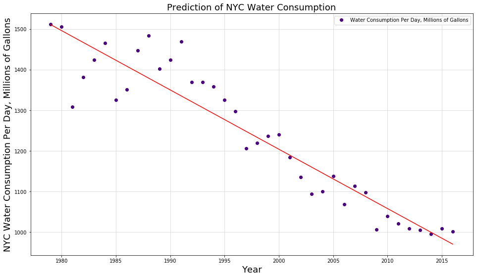

# Plot review

__Plot:__ Prediction of NYC Water Consumption  
__Author:__ Ruben Hambardzumyan (rh2684)  
__Reviewer__ Michael Sampson (mms911)

Ruben's plot is clear and communicates interesting information quickly and succintly.
The points and line are solid and bold enough to be seen against the grid lines. The addition
of grid lines is very useful in this plot that contains a high number of dots and binned intervals. The grid lines help orient where on the x- and y-axis each point is located, useful for searching for points that relate to speciic questions about the data (e.g. "What was the consumption in 1995 compared to 2005?").

The plot contians the basic yet essential elements of a good plot: a title, axis labels with units where appropriate, a legend and a caption. For this plot the legend is a bit excessive but still appreciated. The title could be a little more descriptive by included the time period to which that the data is constrained. It could read,
> "Prediction of NYC Water Consumption, 1979 - 2016"  

This would be helpful since the x-axis values are binned by intervals of five and the points are for individual years. Looking at the plot, it is not immediately clear that the first dot is 1979. It could be 1977,1978, etc. This information is contained in the caption but if the plot is ever separated from the caption (which is not a part of the image file) then that would be useful information to have directly on the plot. For example, this markdown file would not have included the caption had I not copied it over because the caption is not part of the plot image itself.

Rueben included a caption which is helpful for understanding the context of the plot and for providing interesting additional information.

A good plot overall.

including Reuben's caption:

<b>Figure 1</b>: The figure shows the prediction of NYC daily water consumption in millions of gallons based on the historical daily water consumption data for the period of 1979 to 2016. It is interesting that despite the total population increase of 17,3% for the mentioned period the daily water consumption was decreased by 34%! The regression line (R-squared = 0.88) fitted to the data predicts the trend of further consumption reduction.
